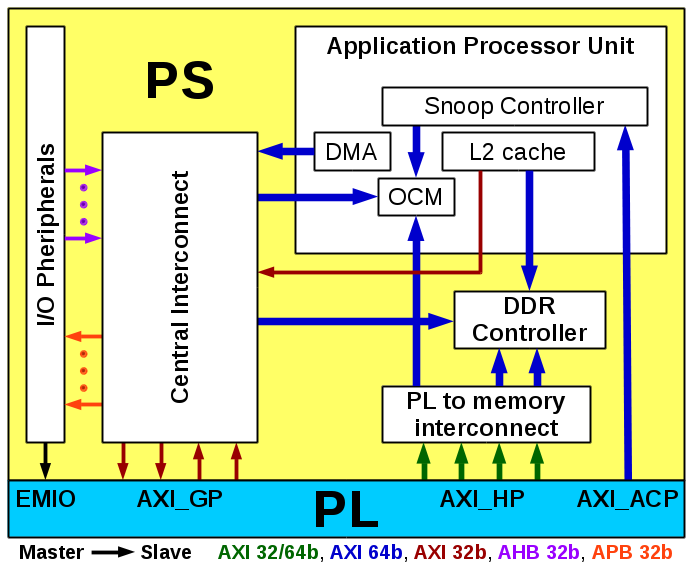

# Zynq-7000 PL-PS interfaces and Their throughput

## Resources

* Zynq-7000 All Programmable SoC Technical Reference Manual (UG585)
* Cortex-A9 MPCore Technical Reference Manual (Revision: r3p0)
* Cortex-A9 Technical Reference Manual (Revision: r2p2)
* AXI Reference Guide (UG761)
* UltraFast Embedded Design Methodology Guide (UG1046)
* Leveraging Data-Mover IPs for Data Movement in Zynq-7000 AP SoC Systems (WP459)

## PL-PS Interfaces

* EMIO:
    * Extended Multiplexed I/O
    * 64 GPIO
* AXI_GP (General Purpose):
    * 4 x 32b, two masters and two slaves, interfaces
* AXI_ACP (Accelerator Coherency Port):
    * 1 x 64b cache coherent slave interface
    * Access to L2 and OCM (transactions are data coherent with L1 and L2 caches)
* AXI_HP (High Performance):
    * 4 x 32/64b high performance/bandwidth slaves interfaces
    * The 4 port can be connected to two DDR memory ports or the OCM

Notes:

* Master and slave are described from the poit of view of the PS
* The AXI interfaces are based on the Standard AXI 3.0

## AXI

* AXI (Advanced eXtensible Interface) is part of ARM AMBA (Advanced Microprocessor Bus Architecture), a family of interfaces between IP cores, introduced in 1996.
* AXI was introduced in AMBA 3.0 (2003) and renamed to AXI3 when AXI4 was introduced in AMBA 4.0 (2010).
* One of the main differences between AXI3 and AXI4, is that the maximun burst length was extended from 16 to 256 in INCR type.
* Additionally, AXI4 defines three interfaces:
    * AXI4 (also known as AXI4-Full) for high-performance memory-mapped requirements
    * AXI4-Lite for simple, low-throughput memory-mapped communication (such as control and status registers)
    * AXI4-Stream for high-speed streaming data (removes address phase and allows unlimited data burst size)
* Xilinx has adopted the AXI protocol (introduced in the ISE Design Suite 12.3) for IP cores beginning with the Spartan-6 and Virtex-6 devices.
* AXI Interconnect does the conversion to allow AXI3 and AXI4 devices to be connected.
